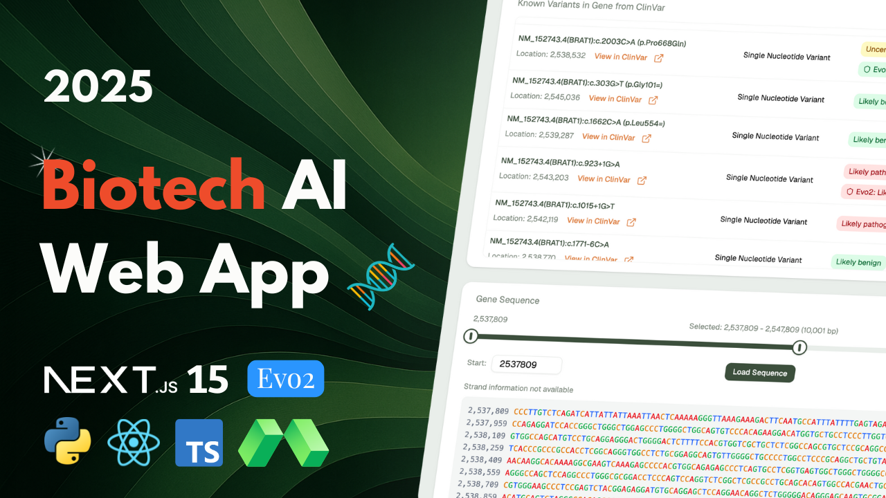

[Link to video](https://youtu.be/3dCZxmd5bvs)

[Discord and more](https://www.andreastrolle.com/)

## Overview

Hi 🤙 In this project, you'll build a web app that can classify how likely specific mutations in DNA are to cause diseases (variant effect prediction). We will deploy and use the state-of-the-art Evo2 large language model, and use it to predict the pathogenicity of single nucleotide variants (SNVs). You'll deploy a Python backend on an H100 serverless GPU with Modal, exposing a FastAPI endpoint for analysis. After deploying the backend, you'll build a web app around it where users can select a genome assembly, browse its chromosomes or search for specific genes like BRCA1, and view the gene's reference genome sequence. The user can input a mutation in the gene and predict its pathogenicity with AI, but the user can also pick from a list of existing known variations, and compare the Evo2 prediction (pathogenic/benign) against existing ClinVar classifications. The web app is built with Next.js, React, TypeScript, Tailwind CSS, and Shadcn UI and is based off of the T3 Stack. You'll be able to build along with me from start to finish.

Everything (including GPU's) is free, and no biological background is needed, since I'll walk you through all the theory needed.

TL;DR / Simpler Version\
DNA is like a long code made of A, T, G, and C. Small changes (mutations) in specific parts of this code, like in genes responsible for preventing cancer, can increase a person's risk of developing the disease. For instance, if an 'A' appears where a 'T' should be at a particular spot, that's a mutation. These changes can vary in how harmful they are, and we'll build a tool to analyze these different variations' harmfulness.

Features:

- 🧬 Evo2 model for variant effect prediction
- 🩺 Predict pathogenicity of single nucleotide variants (pathogenic/benign)
- ⚖️ Comparison view for existing ClinVar classification vs. Evo2 prediction
- 💯 Prediction confidence estimation
- 🌍 Genome assembly selector (e.g., hg38)
- 🗺️ Select genes from chromosome browsing or searching (e.g., BRCA1)
- 🌐 See full reference genome sequence (UCSC API)
- 🧬 Explore gene and variants data (NCBI ClinVar/E-utilities)
- 💻 Python backend deployed with Modal
- 🚀 FastAPI endpoint for variant analysis requests
- ⚡ GPU-accelerated (H100) variant scoring via Modal
- 📱 Responsive Next.js web interface
- 🎨 Modern UI with Tailwind CSS & Shadcn UI

## Evo2 Model

Check out the paper behind the model.

- [Paper](https://www.biorxiv.org/content/10.1101/2025.02.18.638918v1)
- [GitHub Repository](https://github.com/ArcInstitute/evo2)

## Setup

Follow these steps to install and set up the project.

### Clone the Repository

```bash
git clone --recurse-submodules https://github.com/petrushandika/Biotech-AI
```

### Install Python

Download and install Python if not already installed. Use the link below for guidance on installation:
[Python Download](https://www.python.org/downloads/)

Create a virtual environment for each folder, except elevenlabs-clone-frontend, with **Python 3.10**.

### Backend

Navigate to backend folder:

```bash
cd evo2-backend
```

Install dependencies:

```bash
pip install -r requirements.txt
```

Modal setup:

```bash
modal setup
```

Run on Modal:

```bash
modal run main.py
```

Deploy backend:

```bash
modal deploy main.py
```

### Frontend

Install dependencies:

```bash
cd evo2-frontend
npm i
```

Run:

```bash
npm run dev
```
